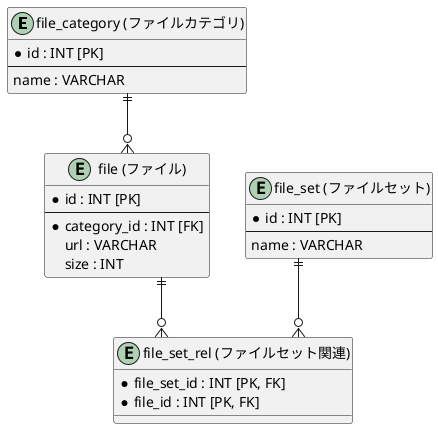

# 📂 データベース（DB）設計方針

## 1. 命名規則（Naming Conventions）
データ構造の明確化と、主要なWebフレームワークとの親和性を高めるため、以下の世界的標準（デファクトスタンダード）を採用します。

* 基本規則:
* すべて小文字の英語表記とする（ローマ字は禁止）。
   * 単語の区切りはスネークケース（snake_case）で統一する。
* テーブル名:
* 今回のスコープでは単数形（file, file_set）で統一する。
   * ※プロジェクト全体で「単数形」か「複数形（files, file_sets）」かを統一することが最重要。
* フィールド名:
* 主キー (PK): テーブル名を冠さず、一律 id とする。
   * 外部キー (FK): [参照先テーブル名]_id（例：category_id）とする。
   * 冗長性の排除: file テーブル内のカラムに file_url のようにテーブル名を繰り返さない（url, size とシンプルに表現する）。

## 2. テーブル間の関連性（リレーション）定義
データの整合性を保ち、パフォーマンス低下やバグを防ぐためのリレーションシップの方針です。

* 多対多（M:N）の禁止と中間テーブルの導入:
* テーブル同士の直接的な「多対多」の結合は禁止する。
   * 必ず中間テーブル（交差テーブル）を挟み、「1対多（1:N）」の関係に分解する。
   * 中間テーブルの命名は、対象となる関係性がわかるよう末尾に _rel（Relation）を付与する（例：file_set_rel）。
* カーディナリティ（多重度）の整理:
* カテゴリとファイルは 1 対 0以上（0 or more） とする（ファイルが1つもないカテゴリの存在を許容する）。

## 3. ER図（PlantUML）記述標準
世界共通のモデリング規格である「IE表記法」を使用します。

* ||（縦線） ＝ 「1」側（親）
* o{（鳥の足） ＝ 「多（0以上）」側（子）

